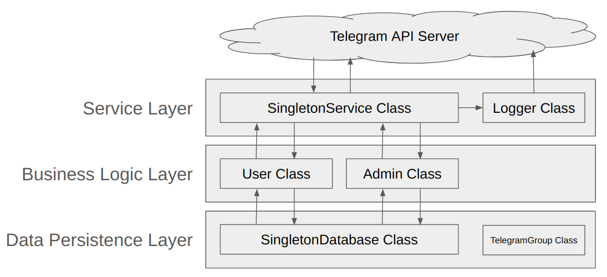

# SUSS Telegram Groups Bot

The telegram handler for this bot is @SUSS_Telegram_Groups_Bot

You may query this bot to retrieve the telegram invitation link for your unit

## Configuration

Create a .env file in the root directory of the project with the following content:

> TOKEN=[Telegram API Token]  
> ADMINS=admin1,admin2,...  
> DATABASE=[file name for database]  

TOKEN is the Telegram API Token.  

ADMINS is a list of Telegram usernames (seperated by commas) who are allowed to perform administrative actions on the bot.  

DATABASE is the filename of the persistence database which contains the telegram invitation links.

## How to use the bot?

The bot only supports commands in Direct Messaging (DM) mode.

### For all users

| Command  | Description | 
| -------- | ------------| 
| /start | Say hi to the user |
| /welcome | Say hi to the user |
| /get all  | Retrieve all telegram invitation links  |
| /get [unit code] | Retrieve the telegram invitation link for the unit | 
| /admins | Retrieve the list of administrators |
| /help | Display the commands available to the user | 

### For admin users

| Command | Description |
|---------|-------------|
| /add [unit code] [link] [unit name] | Add the invitation link for given unit. |
| /update [unit code] link [new link] | Update the invitation link for the given unit. |
| /update [unit code] name [new name] | Update the unit name for the given unit. |
| /rm [unit code] | Remove the invitation link for the given unit. |

## Developer Onboarding

Refer to the [Developer Onboarding Document](onboarding.md) if you are interested to contribute to this project.

## Feature Backlog

* ~~Refactor the codebase to seperate business logic from lower level implementations~~
* Log bot status to telegram channel / group for monitoring
* Support interaction in main channel or topic.
* Backup command to dump the database into a downloadable file
* Restore command to upload the database to the Bot
* Broadcast command to share events in telegram groups 
* Reminder command to support the deadlines of each academic unit

## Software Architecure

The Service Layer is responsible for handling interactions with the Telegram API Server. The SingletonService class interacts with the Telegram API Server via the AsyncTelebot class.  

The Busines Logic Layer consists of Admin Class and User class that provides authentication and authorisation for specific commands. These 2 classes also execute the logic of these commands.  

The Data Persistence Layer provides the SingletonDatabase class that reads and write the underlying data store powered by the Python Shelve module.  

## Who do I talk to?

* Email us at suss_swe_ig@outlook.com for feedback
* If you want to add telegram link to our Bot, contact @geodome on Telegram.